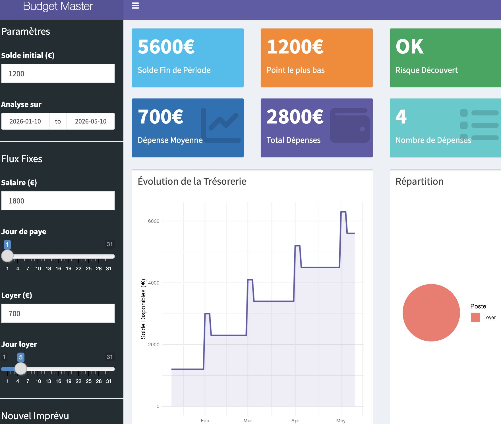
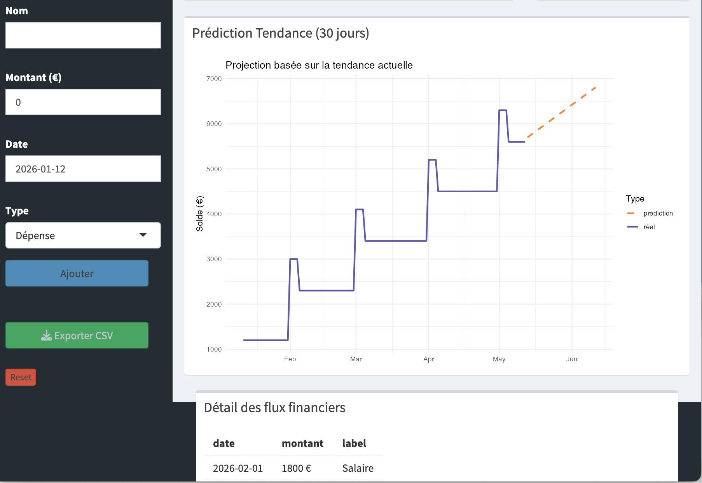

# Simulateur Budget Étudiant

[](LICENSE)


> Application Shiny pour simuler et visualiser l'évolution du budget étudiant avec prédiction ML et analyse statistique.

## Contexte

De nombreux étudiants ont du mal à suivre leur budget et à anticiper leurs dépenses. Ils découvrent souvent trop tard qu'ils sont en situation de découvert.

Ce projet a été développé dans le cadre d'un travail universitaire en analyse de données et a pour objectif de proposer un outil simple qui simule, jour par jour, l'évolution du solde en fonction des revenus, des charges fixes et des imprévus.

L'application s'adresse principalement aux étudiants et jeunes actifs qui souhaitent mieux piloter leur budget sans utiliser des outils financiers complexes.

## Aperçu de l'application




L'application est un outil interactif qui permet aux étudiants d'estimer automatiquement leur budget mensuel à partir de données financières. Le programme simule l'évolution du solde jour par jour, détecte les risques de découvert et propose une visualisation claire et pédagogique de la situation financière dans un dashboard.

**Fonctionnalités principales :**

1. Anticiper son solde bancaire futur en fonction de ses revenus et charges
2. Visualiser graphiquement les périodes de vulnérabilité
3. Émettre une alerte automatique en cas de risque de découvert (montant et date)

## Application en ligne

**Démo disponible** : https://manoucaboul-arch.shinyapps.io/monbudget/

> L'application déployée reflète exactement le code présent dans ce repository.

## Installation

### Prérequis

- R version 4.0 ou supérieure
- RStudio (recommandé)

### Bibliothèques requises
```r
library(shiny)           # Application interactive
library(shinydashboard)  # Interface dashboard
library(dplyr)           # Manipulation de données
library(tidyr)           # Nettoyage de données
library(lubridate)       # Gestion des dates
library(ggplot2)         # Visualisations
```

### Installation des packages
```r
install.packages(c("shiny", "shinydashboard", "dplyr", "tidyr", "lubridate", "ggplot2"))
```

### Lancement local
```r
# Cloner le projet
git clone https://github.com/manoucaboul-arch/Simulateur-budget-etudiant.git

# Ouvrir Budget.R dans RStudio et exécuter
shinyApp(ui, server)
```

## Architecture technique

L'application est construite avec Shiny. Le fichier `Budget.R` (254 lignes) contient toute l'application.

### Les 5 fonctionnalités principales

Notre application repose sur 5 fonctions clés qui assurent la simulation budgétaire complète :

#### Fonctions core (Base du système)

**1. generer_donnees_temporelles()**

Génère automatiquement des flux mensuels récurrents (revenus ou charges) entre deux dates.
```r
generer_donnees_temporelles(montant, jour, nom, debut, fin, type)
```

**Paramètres :**
- `montant` : montant du flux (€)
- `jour` : jour du mois (1-31)
- `nom` : nom du flux ("Salaire", "Loyer", etc.)
- `debut` : date de début
- `fin` : date de fin
- `type` : "revenu" ou "depense"

**Fonctionnement :**
- Crée une séquence de mois
- Applique un signe positif (revenus) ou négatif (dépenses)
- Gère automatiquement les mois avec 28, 29, 30 ou 31 jours

---

**2. simuler_evolution_budget()**

Calcule l'évolution quotidienne du solde bancaire.
```r
simuler_evolution_budget(solde_init, debut, fin, flux_auto, flux_imprevus)
```

**Paramètres :**
- `solde_init` : solde initial (€)
- `debut` : date de début
- `fin` : date de fin
- `flux_auto` : flux fixes (salaire, loyer)
- `flux_imprevus` : dépenses ponctuelles

**Fonctionnement :**
- Crée un calendrier jour par jour
- Fusionne tous les flux
- Calcule le solde cumulé avec `cumsum()`

---

**3. analyser_risques_financiers()**

Détecte les risques de découvert.
```r
analyser_risques_financiers(df_evolution)
```

**Retour :**
- `mini` : solde minimum atteint
- `alerte` : "DANGER" ou "OK"
- `couleur` : "red" ou "green"

**Fonctionnement :**
- Identifie le point le plus bas du solde
- Déclenche une alerte "DANGER" si le solde devient négatif

---

#### Fonctions avancées (Valeur ajoutée)

**4. analyser_depenses()**

Analyse statistique des dépenses.
```r
analyser_depenses(flux_table)
```

**Calcule :**
- `moyenne` : dépense moyenne
- `mediane` : dépense médiane
- `total` : total des dépenses
- `nb` : nombre de dépenses

---

**5. predire_solde()**

Prédiction ML avec régression linéaire.
```r
predire_solde(df_evolution, jours_futurs = 30)
```

**Fonctionnement :**
- Utilise une régression linéaire sur les données historiques
- Projette le solde sur les 30 prochains jours
- Visualise la tendance future

---

### Interface utilisateur

#### Sidebar (Panneau de contrôle)

- Paramètres généraux : solde initial et période d'analyse
- Flux fixes : configuration du salaire et loyer (montant + jour)
- Gestion des imprévus : ajout dynamique de dépenses/revenus
- Export CSV : téléchargement des données
- Reset : réinitialisation des imprévus

#### Dashboard principal

- **6 ValueBoxes** : 
  - Solde final
  - Point le plus bas
  - Alerte de risque
  - Dépense moyenne
  - Total des dépenses
  - Nombre de dépenses
- **Graphique d'évolution** : courbe de trésorerie jour par jour
- **Graphique camembert** : répartition des dépenses par catégorie
- **Graphique de prédiction** : projection sur 30 jours avec tendance ML
- **Tableau détaillé** : liste chronologique de tous les flux

## Utilisation

### Configuration

1. Définir le solde initial
2. Choisir la période d'analyse
3. Configurer les flux fixes (salaire et loyer)
4. Ajouter des imprévus si besoin
5. Exporter les données en CSV si nécessaire

### Interprétation des résultats

| Indicateur | Signification |
|------------|---------------|
| Zone verte | Pas de risque de découvert |
| Zone rouge | Découvert détecté |
| Point le plus bas | Moment le plus critique |
| Solde final | Projection de fin de période |
| Ligne pointillée orange | Prédiction basée sur la tendance ML |

### Exemple d'utilisation

**Scénario étudiant type :**

- Solde initial : 1 200 €
- Salaire : 1 800 € le 1er du mois
- Loyer : 700 € le 5 du mois
- Dépense imprévue : 150 €

**Résultat :**
Le dashboard affiche l'évolution quotidienne et alerte en cas de risque.

## Structure du projet
```
Simulateur-budget-etudiant/
├── Budget.R              # Application Shiny complète (254 lignes)
├── tests.R               # Tests unitaires (8 tests)
├── presentation.Rmd      # Présentation R Markdown
├── presentation.pptx     # Présentation PowerPoint
├── README.md             # Documentation
├── LICENSE               # Licence MIT
├── dashboard.png         # Screenshot du dashboard
└── prediction_tendance.png  # Screenshot de la prédiction
```

## Fonctionnalités

### Fonctionnalités de base

Simulation jour par jour du solde bancaire  
Gestion automatique des flux récurrents  
Détection automatique des risques de découvert  
Visualisation graphique interactive  
Interface Shiny intuitive et professionnelle  
Adaptation aux mois de 28, 29, 30 ou 31 jours  

### Fonctionnalités avancées

**Analyse statistique des dépenses**
- Calcul automatique de la moyenne, médiane et total
- 3 ValueBoxes supplémentaires avec icônes
- Identification des patterns de dépenses

**Prédiction avec Machine Learning**
- Régression linéaire sur les données historiques
- Projection sur 30 jours futurs
- Graphique comparatif réel vs prédiction
- Détection de tendance croissante/décroissante

**Export de données**
- Bouton de téléchargement dans la sidebar
- Export complet de l'évolution du solde
- Format CSV compatible Excel

## Améliorations possibles

### Court terme
- Formatage des montants avec le symbole €
- Catégories de dépenses personnalisables
- Statistiques mensuelles

### Moyen terme
- Synchronisation bancaire via API
- Notifications par email
- Import de relevés bancaires (CSV/PDF)

### Long terme
- Application mobile (iOS/Android)
- Gestion multi-comptes

## Tests et qualité

- **8/8 tests unitaires** passés avec succès
- Validation des inputs utilisateur
- Gestion des erreurs
- Code optimisé (< 2 sec de réponse)

## Contribution

Les contributions sont bienvenues ! Voici comment participer au projet :

1. **Fork** le projet
2. **Créer une branche** : `git checkout -b feature/amelioration`
3. **Commit** vos changements : `git commit -m 'Ajout fonctionnalité X'`
4. **Push** : `git push origin feature/amelioration`
5. **Ouvrir une Pull Request**

### Domaines où contribuer

- Correction de bugs
- Nouvelles fonctionnalités (ML avancé, recommandations IA, etc.)
- Amélioration de la documentation
- Design de l'interface
- Traductions (EN, ES, etc.)

---

## Auteurs

**Développé par :**
- **CABOUL Emma** - [@manoucaboul-arch](https://github.com/manoucaboul-arch)
- **TCHAKAH Abra** - [@bienvenue2002](https://github.com/bienvenue2002)

**Contributions :**
- Développement des fonctions principales et interface Shiny
- Tests et validation des calculs financiers
- Documentation et déploiement de l'application

📧 **Contact** : [Ouvrir une issue](https://github.com/manoucaboul-arch/Simulateur-budget-etudiant/issues)

---

## Remerciements

Merci aux étudiants qui ont testé l'application et fourni leurs retours pour l'améliorer.

**Si ce projet vous aide, n'hésitez pas à lui donner une ⭐ sur GitHub !**

## Licence

Ce projet est sous licence MIT - voir le fichier [LICENSE](LICENSE) pour plus de détails.

---

<div align="center">
  <sub>Projet réalisé dans le cadre du Master MPE - Analyse de données avec R</sub>
</div>
