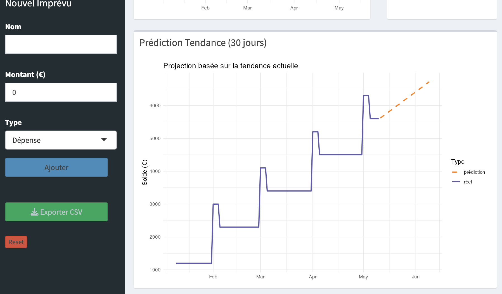

# Simulateur-budget-etudiant

[](LICENSE)

> Application Shiny pour simuler et visualiser l'évolution du budget étudiant.

## Contexte

De nombreux étudiants ont du mal à anticiper leur trésorerie mensuelle et découvrent trop tard les risques de découvert.
Ce projet a été développé dans le cadre d'un travail universitaire afin de proposer un outil simple qui simule, jour par jour, l'évolution du solde en fonction des revenus, des charges fixes et des imprévus.
L'application s'adresse principalement aux étudiants et jeunes actifs qui souhaitent mieux piloter leur budget sans utiliser des outils financiers complexes.

## Aperçu de l'application




Notre projet est un outil interactif qui permet aux étudiants d'estimer automatiquement leur budget mensuel à partir de données financières. Le programme simule l'évolution du solde jour par jour, détecte les risques de découvert et propose une visualisation claire et pédagogique de la situation financière dans un dashboard.

1. Anticiper son solde bancaire futur en fonction de ses revenus et charges
2. Visualiser graphiquement les périodes de vulnérabilité
3. Émet une alerte automatique en cas de risque de découvert (montant et date)

## Le site est directement disponible

https://manoucaboul-arch.shinyapps.io/monbudget/

## Installation

### Bibliothèques requises

```r
library(shiny)
library(shinydashboard)
library(dplyr)
library(tidyr)
library(lubridate)
library(ggplot2)
```

Pour installer ces packages :

```r
install.packages(c("shiny", "shinydashboard", "dplyr", "tidyr", "lubridate", "ggplot2"))
```

## Description du code

L'application est construite avec Shiny. Le fichier `Budget.R` contient toute l'application.

### Les 3 fonctions principales

#### 1. generer_donnees_temporelles()

Génère automatiquement des flux mensuels (revenus ou charges) entre deux dates.

```r
generer_donnees_temporelles(montant, jour, nom, debut, fin, type)
```

Paramètres :
- montant : montant du flux
- jour : jour du mois (1-31)
- nom : nom du flux ("Salaire", "Loyer", etc.)
- debut : date de début
- fin : date de fin
- type : "revenu" ou "depense"

La fonction crée une séquence de mois et applique un signe positif pour les revenus ou négatif pour les dépenses. Elle gère automatiquement les mois avec moins de 31 jours.

#### 2. simuler_evolution_budget()

Calcule l'évolution quotidienne du solde bancaire.

```r
simuler_evolution_budget(solde_init, debut, fin, flux_auto, flux_imprevus)
```

Paramètres :
- solde_init : solde initial
- debut : date de début
- fin : date de fin
- flux_auto : flux fixes (salaire, loyer)
- flux_imprevus : dépenses ponctuelles

La fonction crée un calendrier jour par jour, fusionne tous les flux et calcule le solde cumulé avec `cumsum()`.

#### 3. analyser_risques_financiers()

Détecte les risques de découvert.

```r
analyser_risques_financiers(df_evolution)
```

La fonction identifie le point le plus bas du solde et déclenche une alerte "DANGER" si le solde devient négatif. Elle retourne :
- mini : solde minimum atteint
- alerte : "DANGER" ou "OK"
- couleur : "red" ou "green"

### Nouvelles fonctions avancées

#### 4. analyser_depenses()

Analyse statistique des dépenses.

```r
analyser_depenses(flux_table)
```

Calcule :
- moyenne : dépense moyenne
- mediane : dépense médiane
- total : total des dépenses
- nb : nombre de dépenses

#### 5. predire_solde()

Prédiction avec tendance linéaire.

```r
predire_solde(df_evolution, jours_futurs = 30)
```

Utilise une régression linéaire pour projeter le solde sur les 30 prochains jours basé sur la tendance actuelle.

### Interface Shiny

#### Sidebar

- Paramètres généraux : solde initial et période d'analyse
- Flux fixes : configuration du salaire et loyer
- Gestion des imprévus : ajout de dépenses/revenus ponctuels
- **NOUVEAU**: Bouton Export CSV
- Bouton Reset

#### Dashboard

- 3 Value Boxes : solde final, point le plus bas, alerte de risque
- **NOUVEAU**: 3 Value Boxes statistiques : dépense moyenne, total dépenses, nombre de dépenses
- Graphique d'évolution : courbe de trésorerie
- Graphique camembert : répartition des dépenses
- **NOUVEAU**: Graphique de prédiction : projection sur 30 jours avec tendance
- Tableau : liste des flux

## Utilisation

### Lancer l'application

```r
# Ouvrir le fichier Budget.R dans RStudio et exécuter
shinyApp(ui, server)
```

### Configuration

1. Définir le solde initial
2. Choisir la période d'analyse
3. Configurer les flux fixes (salaire et loyer)
4. Ajouter des imprévus si besoin
5. **NOUVEAU**: Exporter les données en CSV si nécessaire

### Interprétation

- Zone verte : pas de risque
- Zone rouge : découvert détecté
- Point le plus bas : moment critique
- Solde final : projection de fin de période
- **NOUVEAU**: Ligne pointillée orange : prédiction basée sur la tendance

## Structure du projet

```
Simulateur-budget-etudiant/
├── Budget.R       # Application complète
└── README.md      # Documentation
```

## Fonctionnalités

### Fonctionnalités de base
- Simulation jour par jour du solde bancaire
- Gestion automatique des flux récurrents
- Détection automatique des risques de découvert
- Visualisation graphique interactive
- Interface Shiny intuitive
- Adaptation aux mois de 28, 29, 30 ou 31 jours

### Nouvelles fonctionnalités avancées

**Option 1 : Analyse de Dépenses Moyennes**
- Calcul automatique des statistiques de dépenses
- Affichage de la moyenne, médiane et total
- 3 ValueBoxes supplémentaires avec icônes

**Option 2 : Prédiction avec Tendance**
- Régression linéaire sur les données historiques
- Projection sur 30 jours futurs
- Graphique comparé réel vs prédiction

**Option 3 : Export CSV**
- Bouton de téléchargement dans la sidebar
- Export complet de l'évolution du solde
- Format CSV compatible Excel

## Exemple d'utilisation

Scénario étudiant :
- Solde initial : 1200 €
- Salaire : 1800 € le 1er du mois
- Loyer : 700 € le 5 du mois
- Dépense imprévue : 150 €

Le dashboard affiche l'évolution quotidienne et alerte en cas de risque.

## Améliorations possibles

- Catégories de dépenses personnalisables
- Statistiques mensuelles
- Synchronisation bancaire
- Notifications par email

## Problèmes courants

**L'application ne se lance pas**
Vérifier que tous les packages sont installés.

**Erreur de date**
Utiliser le format YYYY-MM-DD.

**Le graphique ne s'affiche pas**
Vérifier que vous avez entré des données.


## Contribution

Les contributions sont bienvenues !

1. Fork le projet
2. Créer une branche : `git checkout -b feature/amelioration`
3. Commit : `git commit -m 'Ajout fonctionnalité X'`
4. Push : `git push origin feature/amelioration`
5. Ouvrir une Pull Request

## Auteurs

Développé par CABOUL Emma et TCHAKAH Abra
- Développement et tests
- Interface utilisateur
- Documentation

## Licence

Ce projet est sous licence MIT - voir le fichier LICENSE pour plus de détails.
